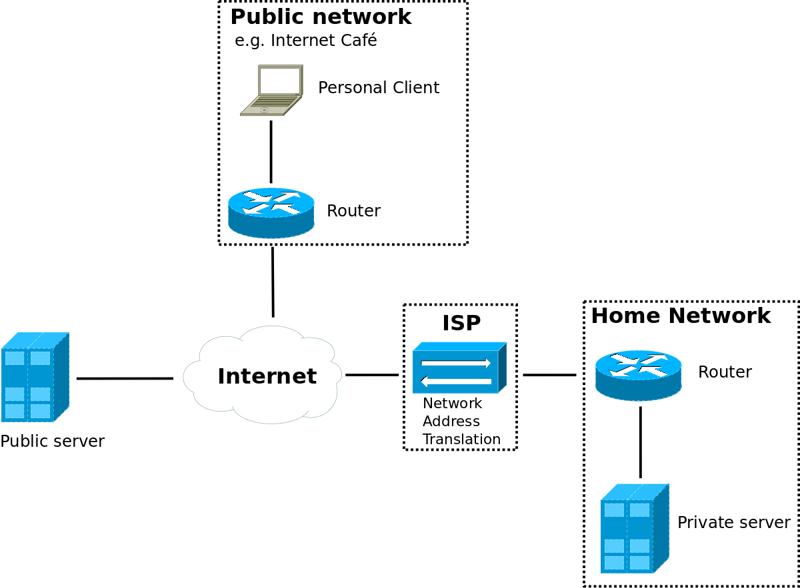

## Arch Linux remote unlock hooks

Have a private server, for example behind a NAT?
Has that server an encrypted drive?
Do you want to remotely unlock the encrypted drive after a reboot?

Then this repository may help you :)

### Terminology

In the following text

**public server** refers to a server, that is reachable from the public
internet.

**private server** refers to a server, that is not easily
reachable from the public internet.
For example because this server is located behind Network Address Translation.

**reverse ssh tunnel**, also remote port forwarding refers to an SSH tunnel,
that makes local resources available on a remote system.

### Summary

This repository contains hooks to establish a reverse SSH tunnel from the early
early user space of a private Arch Linux server with encrypted drive to a public
server.
That enables the creation of an SSH connection to the early user space of the
private Arch Linux server via the public server to unlock the encrypted drive of
the private server.



### Hardware requirements

You need at least

* a public reachable server
* a private server behind a NAT or otherwise not reachable out of the
net
* a client to unlock the private server

### Prerequisites

First setup all hooks required for a SSH daemon in early userspace.
These are

* **mkinitcpio-dropbear** for the dropbear SSH daemon
* **mkinitcpio-network** for networking in early userspace
* **mkinitcpio-utils** for the ability to encrypt the drive via SSH

Install them with

```
pacman -S mkinitcpio-dropbear mkinitcpio-network mkinitcpio-utils
```

and tell **mkinitcpio** to include the into the initial ramdisk by
editing `/etc/mkinitcpio.conf`, finding the line with `HOOKS=(...)`
and adding `netconf dropbear encryptssh` after the `block` hook.

After that two SSH key pairs need to be generated.

1. generate a RSA key pair for the connection from the client to
    the private server (via the SSH tunnel).
    Do this on the client, e.g.

    ```
    ssh-keygen -f ~/.ssh/id_private_server -t rsa -b 4096
    ```

    Then copy the key to `/etc/dropbear/root_key` on the private
    server with **scp**.

2. generate a key pair for dropbear to establish the reverse tunnel
    from the public server.

    Do this on your private server:

    ```
    dropbearkey -t rsa -f /root/.ssh/id_tunnel
    dropbearkey -y -f /root/.ssh/id_tunnel | grep ^ssh-rsa > /root/.ssh/id_tunnel.pub
    ```

    Now copy the **public** key to the `~/.ssh/authorized_keys` file
    of the user used for tunneling on your public server.

Finally configure the network in the early user space for the private
server.
The network is configured using the **ip** kernel parameter.
The full syntax is

```
ip=client_ip:server_ip:gateway_ip:netmask:hostname:device:autoconf:dns0_ip:dns1_ip
```

Assuming the server should have the address `192.168.178.161` in the
network `192.168.178.1/24` with the gateway `192.168.178.1` on the
interface `eth0`. (Note: User kernel device names instead of the
udev ones), one would append

```
ip=192.168.178.161::192.168.178.1:255.255.255.0::eth0:none
```

to the kernel command line.

### Installation

Download the arch-remote-unlock-hooks to your private server.
Then configure the project with

```
./configure
```

The following parameters are available for the configure script:

| Parameter     | Environment Variable | Default value        | Description                                                                                        |
|---------------|----------------------|----------------------|----------------------------------------------------------------------------------------------------|
| -a, --address | REMOTE_ADDRESS       |                      | The listen address including the port of the tunnel on the remote server. Example: `10.8.0.1:1022` |
| -k, --key     | SSH_KEY              | `~/.ssh/id_rsa`      | The path of the identity file (SSH private key) used for the connection to the public server.      |
| --known-hosts | KNOWN_HOSTS_FILE     | `~/.ssh/known_hosts` | The path of the known_hosts file including the public SSH key of the public server.                |
| -p, --prefix  | PREFIX               | `/etc/initcpio`      | The path to the directory with the initcpio hooks.                                                 |
| -s, --server  | SERVER               |                      | The ip address for the connection to the public server.                                            |
| -u, --user    | USER                 | `root`               | The user for the SSH connection to the public server.                                              |

At least the paramters **--address** and **--server** are required.

Now install add the hooks to the initcpio configuration directory with

```
make install
```

Finally rebuild the initramfs with

```
mkinitcpio -p linux
```
